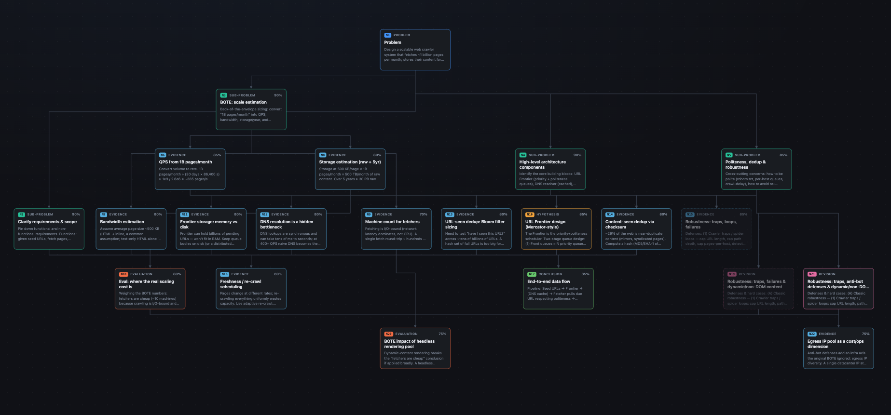
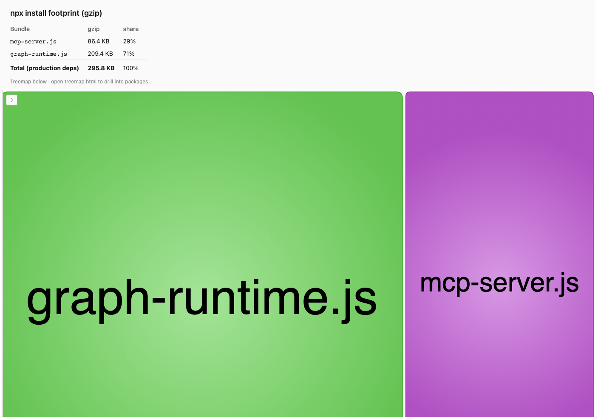

# 💭 thought-graph-mcp

If it's hallucinating, make it think. Inspired by a [research paper](https://research.google/blog/thinking-to-recall-how-reasoning-unlocks-parametric-knowledge-in-llms/), this local MCP makes an LLM reason out loud as an explicit, editable **graph of small thinking steps** instead of one opaque answer.

<p align="center">
  
  <br />
  <em>Example: <a href="examples/web-crawler-design/web-crawler-system-design-bote-estimation-b8cf4764.html">web crawler system design with back-of-the-envelope estimation</a></em>
</p>


1. **Injects guidance** that instructs the LLM to break a complex problem into
   multiple smaller reasoning paths (returned by the `begin_thinking` tool).
2. **Saves the thinking process to a Markdown file** (`.md`) — every step, with
   dependencies, branches, confidence, and revisions.
3. **Renders an interactive HTML graph** (`.html`) so you can *see* each step as a
   node and how they connect.
4. Lets you **understand how the LLM reached the answer** by walking the graph
   node-by-node (click any node for its full reasoning).
5. Lets you **pinpoint a specific step and regenerate it** — the `revise_step` tool
   supersedes that node, drops in a fresh revision, and tells the model which
   downstream steps to reconsider.

https://github.com/user-attachments/assets/29162024-35ce-4b98-8be2-9745560fe16a

## Demo

Explore a full **web crawler system design** session

https://github.com/user-attachments/assets/b3341f27-89af-460a-927f-b4f65a39090d


## Get Started

### Claude Desktop

Edit `claude_desktop_config.json`:
- macOS: `~/Library/Application Support/Claude/claude_desktop_config.json`
- Windows: `%APPDATA%\Claude\claude_desktop_config.json`

```json
{
  "mcpServers": {
    "thought-graph": {
      "command": "npx",
      "args": ["-y", "thought-graph-mcp"],
      "env": {
        "THOUGHT_GRAPH_DIR": "~/thought-graph-sessions"
      }
    }
  }
}
```
Session artifacts default to `~/thought-graph-sessions/`. Override with `THOUGHT_GRAPH_DIR` in the server's `env` block if you want a different folder.

Restart Claude Desktop. Enable the server under the 🔌 (MCP) menu — the **tools** (`begin_thinking`, `add_thought`, etc.) become available to the model.

### Claude Code

Project-scoped (create `.mcp.json` in your project root):

```json
{
  "mcpServers": {
    "thought-graph": {
      "command": "npx",
      "args": ["-y", "thought-graph-mcp"]
    }
  }
}
```

Or add it from the CLI:

```bash
claude mcp add thought-graph -- npx -y thought-graph-mcp
```

Verify with `claude mcp list`.


## Try it

In the client, ask:

> Use the thought-graph tools to reason about: *should our team migrate from REST to GraphQL?*

The model will call `begin_thinking`, decompose into sub-problems, branch competing
hypotheses, attach evidence, and `finalize_thinking`. Open the generated `.html`:

- **Click a node** → full reasoning + its dependencies in the side panel.
- **Spot a weak step** (e.g. `n4`) → tell the assistant
  *"revise step n4 of session <id> — that assumption is wrong because …"*.
  It calls `revise_step`, the node is dimmed as superseded, a revision replaces it,
  and the graph rebuilds.


## Examples

Here are a few examples of using the MCP tool to analyze mission-critical LLM inference.

| Example | Problem | Nodes | Directory |
|---------|---------|------:|-----------|
| Web crawler system design + BOTE | Design a crawler for ~1B pages/month — politeness, dedup, refresh — with back-of-the-envelope sizing for storage, bandwidth, QPS, and fleet size | 18 | [examples/web-crawler-design/](examples/web-crawler-design/) |
| Rate limit service design | Design a distributed rate limiter — high throughput, low latency, flexible per-user/key/endpoint rules, graceful degradation | 21 | [examples/rate-limit-service-design/](examples/rate-limit-service-design/) |
| Autocomplete feature design | Design typeahead suggestions — data source, matching/ranking, frontend UX, latency, accessibility | 14 | [examples/autocomplete-feature-design/](examples/autocomplete-feature-design/) |


---

## How it works

### Prompt

The [guidance](src/prompt.ts) in src/prompt.ts is injected into the context window when the tool `begin_thinking` is called, instructing the model to build the thought graph.

### Node types

Every node in the graph has a **type**. It drives node color in the HTML graph, grouping in the Markdown export, and the shape of the reasoning protocol the model follows.

| Type | Label | What it represents | How it's created |
|------|-------|--------------------|------------------|
| `root` | 🎯 Problem | The original question the session is about | Automatically by `begin_thinking` (node `n1`) |
| `decompose` | 🔱 Decompose | A framing step that breaks the problem into axes or sub-questions | `add_thought` |
| `subproblem` | 🧩 Sub-problem | One focused piece of the larger problem to solve | `add_thought` |
| `hypothesis` | 💡 Hypothesis | A candidate idea or approach — sibling hypotheses are parallel branches | `add_thought` |
| `evidence` | 📎 Evidence | A fact, observation, or computation that supports a path | `add_thought` |
| `evaluation` | ⚖️ Evaluation | Weighing trade-offs or checking whether a hypothesis holds | `add_thought` |
| `revision` | ♻️ Revision | A corrected replacement for an earlier step | Automatically by `revise_step` (original node is kept but dimmed as *superseded*) |
| `conclusion` | ✅ Conclusion | A synthesized partial or final answer for a branch | `add_thought`; the session-level answer is recorded separately via `finalize_thinking` |

**Typical flow:** `root` → `decompose` → one or more `subproblem` nodes → competing `hypothesis` branches on each → `evidence` / `evaluation` attached to the relevant branch → `conclusion` nodes that merge paths → `finalize_thinking` for the overall answer. If a step turns out wrong, `revise_step` inserts a `revision` node and flags downstream dependents for reconsideration.

---

## MCP Size

`npx -y thought-graph-mcp` downloads the npm package and its dependencies into your npm/npx cache, then runs the MCP server as a Node.js process over stdio. You do **not** need to clone this repo or run a bundler.

| What | Approx. size | Role |
|------|-------------:|------|
| **npm package** (`thought-graph-mcp`) | ~280 KB download · ~1.2 MB unpacked | Compiled MCP server (`dist/`), Handlebars template, plus pre-copied browser assets in `dist/_vendor/` (~1 MB) and `dist/_graph/` (~22 KB) |
| **npm dependencies** (installed once, cached by npx) | ~45–55 MB on disk | Libraries the **server** uses at runtime (see table below) |
| **Session folder** (grows as you reason) | ~0.7–1 MB per session `.html` | Self-contained graph file (embeds static CSS/JS from the package) plus ~10–20 KB `.json` / `.md` sidecars |

**Total first-time footprint:** roughly **50–60 MB** in npm cache. Each session `.html` is ~0.7–1 MB (mostly the graph runtime block below).

#### What `npx` installs (gzip treemap)

| Treemap region | bundled | share | What it is |
|----------------|---------------:|------:|------------|
| **`graph-runtime.js`** | **209.4 KB** | 71% | Graph HTML stack: cytoscape, html2canvas, dagre, marked, dompurify, `graph.client.js`, … — embedded in each session `.html` |
| **`mcp-server.js`** | **86.4 KB** | 29% | MCP server process: `@modelcontextprotocol/sdk`, `zod`, `handlebars`, transitive server deps |
| **Total** | **295.8 KB** | 100% | Minified production dependency tree (gzip); on disk `node_modules` is larger (~45–55 MB) because packages ship source, types, and unminified files |

<p align="center">
  <a href="docs/bundle-analysis/treemap.html">
    
  </a>
  <br />
  <em>gzip sizes · <a href="docs/bundle-analysis/treemap.html">interactive treemap</a> · regenerate with <code>npm run analyze:bundle:all</code> (writes <code>docs/bundle-analysis/summary.json</code>)</em>
</p>

#### Session artifacts on disk

After your first `begin_thinking` call, expect this layout:

```
~/thought-graph-sessions/
  assets/                         # static graph runtime (copied once per package version)
    .asset-version
    vendor/                       # cytoscape, dagre, marked, html2canvas, … (~1 MB)
    graph/                        # graph.css, graph.client.js (~22 KB)
  sessions/
    my-problem-abc12345.html      ~0.7–1 MB — embeds assets (Claude in-app browser)
    my-problem-abc12345.json      ~10–20 KB
    my-problem-abc12345.md        ~10 KB
```
