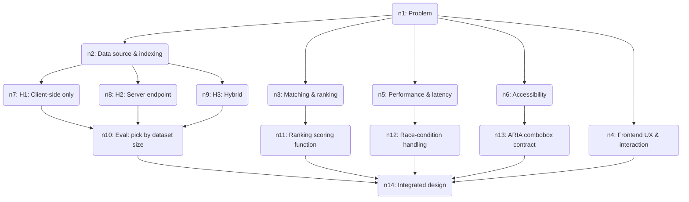

# 🧠 Thought Graph — Autocomplete feature design

> **Problem:** Design an autocomplete feature: as a user types into an input, show ranked suggestions that can be selected via keyboard or mouse. Needs to cover data source, matching/ranking, frontend UX, performance/latency, and accessibility.
>
> Session `a645f6ab-fbfa-4b41-875a-3d5a13b3d780` · 14 steps · last updated 2026-06-30T03:49:03.012Z

## Reasoning graph

_Open the companion `.html` file for an interactive, clickable version._

## Steps

### `n1` 🎯 Problem — Problem

Design an autocomplete feature: as a user types into an input, show ranked suggestions that can be selected via keyboard or mouse. Needs to cover data source, matching/ranking, frontend UX, performance/latency, and accessibility.

### `n2` 🧩 Sub-problem — Data source & indexing
 · from n1

Where do suggestions come from and how are they stored for fast lookup? Options: static client-side list, server-side search endpoint, or hybrid (cache popular terms client-side, fall back to server). Index structure matters: trie/prefix-tree for prefix matching, inverted index for substring/fuzzy, or a search service (Elasticsearch/Typesense/Algolia).

### `n3` 🧩 Sub-problem — Matching & ranking
 · from n1

How candidates are matched against the query and ordered. Matching: prefix vs substring vs fuzzy (typo-tolerant, edit distance). Ranking signals: lexical relevance, popularity/frequency, recency, personalization (user history), and business boosts. Need a deterministic, explainable scoring function and a cap on returned results (e.g. top 8-10).

### `n4` 🧩 Sub-problem — Frontend UX & interaction
 · from n1

The visible behavior: dropdown listbox under the input, keyboard nav (arrow up/down, Enter to select, Esc to dismiss, Tab), mouse hover/click, highlighting the matched substring, empty/no-results state, loading state, and selection behavior (fill input, fire onChange, optionally navigate). Also debounce of input and minimum trigger length.

### `n5` 🧩 Sub-problem — Performance & latency
 · from n1

Perceived speed is the make-or-break factor. Concerns: debouncing keystrokes (~150ms), request cancellation for stale responses (race conditions), client-side caching of prior queries, request coalescing, and keeping p95 round-trip under ~100-200ms. Out-of-order responses must never overwrite a newer query's results.

### `n6` 🧩 Sub-problem — Accessibility
 · from n1

Must follow the WAI-ARIA combobox pattern so screen readers and keyboard-only users work. role=combobox on input with aria-expanded, aria-controls, aria-activedescendant pointing at the active option; the list is role=listbox with role=option children; announce result counts via an aria-live region. This is non-optional for a production input.

### `n7` 💡 Hypothesis — H1: Client-side only
 · from n2 · confidence 50%

Ship the full suggestion list to the browser, match locally with a trie. Pros: zero network latency, works offline, trivial infra. Cons: only viable for small, static datasets (≤ a few thousand items, ≤ ~1MB); no personalization; payload grows with data.

### `n8` 💡 Hypothesis — H2: Server endpoint
 · from n2 · confidence 60%

A /suggest?q= endpoint backed by a search service (Typesense/Elasticsearch/Algolia) or a DB prefix index. Pros: scales to millions of items, supports fuzzy + personalization + fresh data. Cons: network latency per keystroke, infra + cost, must handle race conditions and rate limiting.

### `n9` 💡 Hypothesis — H3: Hybrid
 · from n2 · confidence 70%

Server endpoint as source of truth, but cache the top-N popular queries and the user's recent selections client-side. Serve instant results from cache, fetch server results in parallel, merge. Pros: instant feel for common cases, scales, personalized. Cons: more complex, cache invalidation/merge logic.

### `n10` ⚖️ Evaluation — Eval: pick by dataset size
 · from n7, n8, n9 · confidence 75%

The choice is dominated by dataset size and need for freshness/personalization. Decision rule: ≤ ~2k static items → H1 (client-side trie). Large/dynamic/personalized → H3 hybrid, which subsumes H2's endpoint while keeping the instant feel of H1. Pure H2 is the simplest scalable baseline if caching complexity isn't yet justified. Recommend H3 as the target architecture, implemented incrementally starting from H2.

### `n11` 📎 Evidence — Ranking scoring function
 · from n3 · confidence 70%

score = w1·matchQuality + w2·log(popularity) + w3·recencyDecay + w4·personalBoost. matchQuality favors prefix > word-boundary > substring > fuzzy; exact match floats to top. Tie-break by popularity then alphabetical for determinism. Apply typo tolerance (edit distance ≤1 for ≥4-char tokens) only when strict matching yields few results. Cap at top 8.

### `n12` 📎 Evidence — Race-condition handling
 · from n5 · confidence 85%

Each request carries a monotonically increasing seq (or use AbortController to cancel in-flight requests on new keystroke). Only apply a response if its seq is the latest dispatched; drop stale ones. Combine with a 150ms debounce and a min query length of 1-2 chars. Cache results keyed by normalized query string so backspacing is instant. This single mechanism is the highest-leverage correctness fix.

### `n13` 📎 Evidence — ARIA combobox contract
 · from n6 · confidence 90%

Input: role=combobox, aria-expanded, aria-controls=listId, aria-autocomplete=list, aria-activedescendant=activeOptionId. List: role=listbox id=listId. Each item: role=option, unique id, aria-selected on the active one. A visually-hidden aria-live=polite region announces "N results available". Arrow keys move aria-activedescendant WITHOUT moving DOM focus (focus stays in input). Esc collapses; Enter commits the active option.

### `n14` ✅ Conclusion — Integrated design
 · from n10, n11, n12, n13, n4 · confidence 80%

A self-contained <Autocomplete> component owns input state, debounce, request seq/abort, an LRU query cache, and keyboard/ARIA state. It calls a pluggable suggestionSource(query, signal) — backed locally by a trie (H1) or by /suggest (H2/H3) depending on dataset. Source returns pre-ranked top-8 results. Component renders the ARIA combobox, handles selection (fill + onSelect callback), and degrades gracefully (no-results, error, loading). This cleanly separates the four concerns and lets the backend evolve without UI changes.

---

## ✅ Final answer

Autocomplete design — a single <Autocomplete> component over a pluggable suggestion source.

ARCHITECTURE (data source)
- Decision rule by dataset: ≤ ~2k static items → ship to client, match with a trie (zero latency). Large/dynamic/personalized → server /suggest endpoint backed by a search service (Typesense/Elasticsearch/Algolia) or DB prefix index. Best target: HYBRID — server is source of truth, but cache top-N popular queries + the user's recent picks client-side for an instant feel. Start with the plain server endpoint and add the cache layer when justified.
- The UI talks to one interface: suggestionSource(query, signal) -> ranked top-8. Swapping local-trie vs server doesn't change the component.

MATCHING & RANKING
- Match priority: exact > prefix > word-boundary > substring > fuzzy (edit distance ≤1, only for ≥4-char tokens and only when strict matching is thin).
- score = w1·matchQuality + w2·log(popularity) + w3·recencyDecay + w4·personalBoost. Deterministic tie-break: popularity, then alphabetical. Cap results at ~8.

PERFORMANCE (the make-or-break part)
- Debounce keystrokes ~150ms; min query length 1–2.
- Race safety: tag each request with an increasing seq (or AbortController) and apply only the latest response; drop stale ones — this prevents out-of-order results clobbering newer queries.
- LRU cache keyed by normalized query so backspacing/repeat queries are instant. Target p95 round-trip <100–200ms.

FRONTEND UX
- Dropdown listbox under the input; highlight the matched substring. Keyboard: ↑/↓ move active option, Enter commits, Esc closes, Tab/blur dismisses; mouse hover + click. Explicit loading, no-results, and error states. Selection fills the input and fires onSelect.

ACCESSIBILITY (WAI-ARIA combobox, non-optional)
- Input: role=combobox, aria-expanded, aria-controls, aria-autocomplete=list, aria-activedescendant.
- List: role=listbox; items role=option with aria-selected on the active one.
- Arrow keys move aria-activedescendant while DOM focus STAYS in the input; a visually-hidden aria-live=polite region announces "N results available".

The four concerns stay decoupled: backend ranking/source can evolve independently of the accessible, race-safe UI component.
