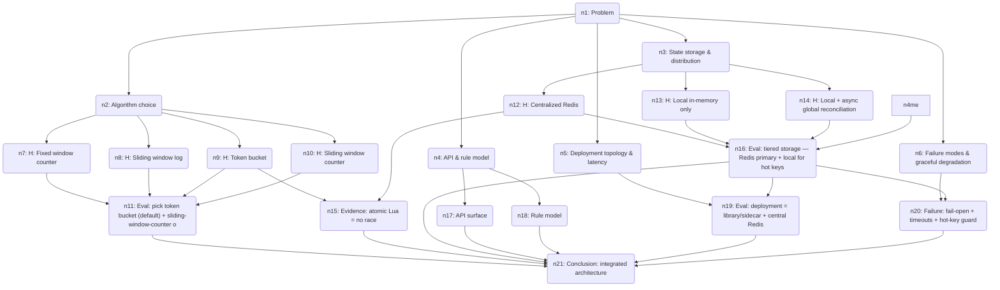

# 🧠 Thought Graph — Rate Limit Service Design

> **Problem:** Design a distributed rate limiting service that other backend services can call to decide whether to allow or reject incoming requests. It must handle high throughput, low latency, be horizontally scalable, support flexible rules (per-user, per-API-key, per-endpoint), and degrade gracefully under failure.
>
> Session `26c0cf67-12b0-499b-bfe2-65edc6bb53a9` · 21 steps · last updated 2026-06-30T03:25:15.887Z

## Reasoning graph

_Open the companion `.html` file for an interactive, clickable version._

## Steps

### `n1` 🎯 Problem — Problem

Design a distributed rate limiting service that other backend services can call to decide whether to allow or reject incoming requests. It must handle high throughput, low latency, be horizontally scalable, support flexible rules (per-user, per-API-key, per-endpoint), and degrade gracefully under failure.

### `n2` 🧩 Sub-problem — Algorithm choice
 · from n1

Which rate-limiting algorithm to use: fixed window, sliding window log, sliding window counter, token bucket, or leaky bucket. This determines accuracy, burst tolerance, and memory cost per key.

### `n3` 🧩 Sub-problem — State storage & distribution
 · from n1

Where counter state lives so it is consistent across many service replicas: centralized store (Redis), local in-memory with sync, or sharded/partitioned counters. Drives latency, consistency, and scalability.

### `n4` 🧩 Sub-problem — API & rule model
 · from n1

The interface callers use (e.g. check/allow RPC) and how flexible rules are configured and matched: per-user, per-API-key, per-endpoint, tiered quotas, composite keys.

### `n5` 🧩 Sub-problem — Deployment topology & latency
 · from n1

How the service is integrated: central service RPC, sidecar/library at the edge, or hybrid (local token allocation with central reconciliation). Governs the latency added to each request.

### `n6` 🧩 Sub-problem — Failure modes & graceful degradation
 · from n1

What happens when the store or service is down or slow: fail-open vs fail-closed, timeouts, local fallback, and protecting the store itself from overload (hot keys).

### `n7` 💡 Hypothesis — H: Fixed window counter
 · from n2 · confidence 40%

Fixed window: one counter per key per time window (e.g. minute). Cheap (single int), trivial to reason about. But allows 2x burst at window boundaries and gives jagged enforcement.

### `n8` 💡 Hypothesis — H: Sliding window log
 · from n2 · confidence 30%

Sliding window log: store timestamp of every request in a sorted set, count those within the window. Exact, no boundary burst. But memory grows with request rate (O(N) per key) and trimming is costly — bad for high throughput / hot keys.

### `n9` 💡 Hypothesis — H: Token bucket
 · from n2 · confidence 70%

Token bucket: per key store {tokens, lastRefill}. Tokens refill at rate r up to capacity b; each request consumes one. Allows controlled bursts up to b, smooths to average r. O(1) memory and compute, lazily computed on read. Natural fit for "rate + burst" semantics.

### `n10` 💡 Hypothesis — H: Sliding window counter
 · from n2 · confidence 60%

Sliding window counter: keep current + previous fixed-window counts and interpolate by elapsed fraction. Approximates a true sliding window with O(1) state, smooths the boundary burst problem. Slightly approximate but cheap.

### `n11` ⚖️ Evaluation — Eval: pick token bucket (default) + sliding-window-counter option
 · from n7, n8, n9, n10 · confidence 80%

Weighing the four: log is too memory-heavy for hot keys; fixed window has boundary bursts. Token bucket wins for default — O(1) state, explicit burst (capacity) and sustained rate (refill) parameters, lazily evaluated, expressible as a tiny atomic script. Offer sliding-window-counter as an alternate policy when callers want strict "N per window" with no burst. Both are O(1) and implementable as a single atomic store operation.

### `n12` 💡 Hypothesis — H: Centralized Redis
 · from n3 · confidence 70%

All replicas read/write a shared Redis (cluster). Strong-ish global accuracy, simple mental model. Atomic Lua script does refill+consume in one round trip. Risks: network hop per check (~0.5-2ms), Redis becomes the bottleneck/SPOF, hot keys land on one shard.

### `n13` 💡 Hypothesis — H: Local in-memory only
 · from n3 · confidence 35%

Each replica enforces limits from its own RAM, no shared state. Zero added latency, no SPOF. But the global limit is effectively limit × replica_count unless traffic is perfectly sharded — inaccurate under load balancing across N nodes.

### `n14` 💡 Hypothesis — H: Local + async global reconciliation
 · from n3 · confidence 60%

Each node keeps a local token allotment and periodically syncs counts to a central tier (or gossip), which redistributes the global budget. Fast local decisions, approximate global accuracy, resilient if central tier blips. More complex; brief over/under-admission during sync windows.

### `n15` 📎 Evidence — Evidence: atomic Lua = no race
 · from n9, n12 · confidence 85%

Token bucket on Redis is a single Lua script keyed by the rate-limit key: read {tokens,ts}, compute refill = (now-ts)*r capped at b, if tokens>=1 decrement and allow else deny, write back with TTL. Executes atomically server-side in one round trip — eliminates read-modify-write races across replicas and keeps it at one network hop.

### `n16` ⚖️ Evaluation — Eval: tiered storage — Redis primary + local for hot keys
 · from n12, n13, n14, n4me · confidence 75%

Pure-local is too inaccurate; pure-central adds a hop and concentrates hot keys. Choose centralized Redis (cluster, key-sharded) as the source of truth for correctness, and add the local-allotment pattern (n14) only for extreme hot keys / strict latency paths: a node leases a slice of the budget locally and reconciles. Default path = Redis Lua; hot-key path = local lease. This merges accuracy with scalability.

### `n17` 💡 Hypothesis — API surface
 · from n4 · confidence 80%

gRPC (and HTTP) method ShouldAllow(descriptors[], cost=1) → {allowed, remaining, limit, retryAfter, resetAt}. Descriptors are ordered key-value tuples e.g. [(user_id, 42),(endpoint, /search)]. Batch-friendly so a caller can check multiple limits in one RPC. Response carries headers (X-RateLimit-*) for the caller to forward.

### `n18` 💡 Hypothesis — Rule model
 · from n4 · confidence 75%

Declarative rule config (hot-reloadable, versioned): each rule matches a descriptor pattern and binds {algorithm, rate, burst, window}. Support wildcards and tiers (free/pro/enterprise → different quotas), and "most-specific match wins" or "all-matching-rules AND'd" (request allowed only if every applicable limit permits). The composite key = hash(matched descriptors) → the storage key.

### `n19` ⚖️ Evaluation — Eval: deployment = library/sidecar + central Redis
 · from n5, n16 · confidence 70%

Comparing central-service-RPC vs sidecar-library: a standalone service adds an extra network hop on every request. Prefer a thin client library (or sidecar) embedded in callers that talks directly to the Redis cluster via the Lua script, with a small control-plane service only for rule distribution and metrics. This removes one hop, keeps p99 low, and still centralizes state. Builds on the storage decision (n16).

### `n20` ⚖️ Evaluation — Failure: fail-open + timeouts + hot-key guard
 · from n6, n16 · confidence 80%

Degradation policy: tight timeout on the store call (e.g. 5-10ms); on timeout/error, fail-open by default (allow) for availability, but make it per-rule configurable (critical abuse-prevention limits can fail-closed). Each client keeps a local fallback limiter that activates when Redis is unreachable so you don't go fully unprotected. Protect Redis from hot keys via local lease (n16) and request coalescing; use Redis replicas + cluster failover for the store's own HA.

### `n21` ✅ Conclusion — Conclusion: integrated architecture
 · from n11, n15, n16, n17, n18, n19, n20 · confidence 82%

Synthesis: A thin client library/sidecar calls a Redis Cluster (key-sharded) running an atomic token-bucket Lua script as the default algorithm, with sliding-window-counter as an alternate policy. Rules are declarative, hot-reloaded from a lightweight control plane, matched by descriptor patterns into composite keys; all applicable limits must pass. Hot keys and strict-latency paths use local budget leasing with async reconciliation. Failures are handled with tight timeouts, per-rule fail-open/closed, and a local fallback limiter; Redis HA via replicas + failover. Observability (allow/deny metrics, per-rule dashboards) rounds it out.

---

## ✅ Final answer

## Rate Limit Service — Design

**Algorithm.** Default to **token bucket** (O(1) state `{tokens, lastRefill}`, explicit `rate` + `burst`, smooth enforcement). Offer **sliding-window-counter** as an alternate policy for strict "N per window" with no burst. Reject sliding-window-log (memory grows with traffic) and fixed-window (boundary bursts) for the high-throughput default.

**State storage.** Centralized **Redis Cluster**, key-sharded, as source of truth. The refill+consume runs as a single **atomic Lua script** per key — one round trip, no read-modify-write races across replicas. For extreme hot keys / strict-latency paths, layer in **local budget leasing**: a node leases a slice of the global budget and reconciles asynchronously.

**API.** `ShouldAllow(descriptors[], cost=1) → {allowed, remaining, limit, retryAfter, resetAt}`. Descriptors are ordered tuples, e.g. `[(user_id,42),(endpoint,/search)]`; batchable so multiple limits check in one RPC. Response carries `X-RateLimit-*` headers for the caller to forward.

**Rules.** Declarative, versioned, hot-reloadable config. Each rule matches a descriptor pattern → binds `{algorithm, rate, burst, window}`, supports wildcards and tiers (free/pro/enterprise). A request must pass **every** applicable limit (AND semantics); the composite key = hash of matched descriptors.

**Deployment.** Thin **client library / sidecar** embedded in callers talks directly to Redis via the Lua script — avoids an extra service hop on every request. A lightweight **control plane** handles only rule distribution and metrics aggregation.

**Failure / degradation.** Tight store timeout (~5–10ms); on error **fail-open by default**, per-rule configurable to fail-closed for abuse-prevention limits. A **local fallback limiter** activates when Redis is unreachable so you're never fully unprotected. Redis HA via replicas + cluster failover; hot keys protected by local leasing and request coalescing.

**Observability.** Allow/deny counters, per-rule and per-tenant dashboards, alerting on deny spikes and store latency.

This balances accuracy (central atomic state), latency (no extra hop, hot-key leasing), scalability (sharded cluster), flexibility (declarative composite rules), and resilience (fail-open + local fallback).
