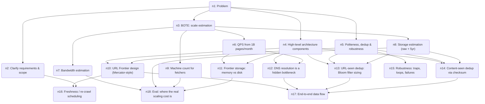

# 🧠 Thought Graph — Web Crawler System Design + BOTE Estimation

> **Problem:** Design a scalable web crawler system that fetches ~1 billion pages per month, stores their content for search indexing, respects politeness/robots.txt, avoids duplicate crawling, and refreshes pages over time. Use back-of-the-envelope estimation to size storage, bandwidth, QPS, and the number of crawler machines required.
>
> Session `b8cf4764-8b00-48aa-9ac7-8aec79a34a0b` · 18 steps · last updated 2026-06-30T15:16:25.558Z

## Reasoning graph

_Open the companion `.html` file for an interactive, clickable version._

## Steps

### `n1` 🎯 Problem — Problem

Design a scalable web crawler system that fetches ~1 billion pages per month, stores their content for search indexing, respects politeness/robots.txt, avoids duplicate crawling, and refreshes pages over time. Use back-of-the-envelope estimation to size storage, bandwidth, QPS, and the number of crawler machines required.

### `n2` 🧩 Sub-problem — Clarify requirements & scope
 · from n1 · confidence 90%

Pin down functional and non-functional requirements. Functional: given seed URLs, fetch pages, extract links, store HTML content for downstream indexing, re-crawl to keep fresh. Non-functional: scalable to ~1B pages/month, polite (robots.txt + per-host rate limits), robust (handle failures/dead links/traps), extensible (new content types/parsers), deduplicate content. Out of scope for first pass: JS rendering, full-text indexing itself (that's a separate system). This frames the scale numbers everything else depends on.

### `n3` 🧩 Sub-problem — BOTE: scale estimation
 · from n1 · confidence 90%

Back-of-the-envelope sizing: convert "1B pages/month" into QPS, bandwidth, storage/year, and machine count. This is the quantitative backbone that justifies the architecture (how many fetchers, how big the URL store, how much network).

### `n4` 🧩 Sub-problem — High-level architecture components
 · from n1 · confidence 90%

Identify the core building blocks: URL Frontier (priority + politeness queues), DNS resolver (cached), HTML Downloader (fetcher workers), Content Parser/extractor, Content-Seen dedup (checksum store), URL-Seen dedup (Bloom filter / set), URL extractor + filter, and the storage tier (raw content store + metadata DB). Plus a scheduler for re-crawl/freshness.

### `n5` 🧩 Sub-problem — Politeness, dedup & robustness
 · from n1 · confidence 85%

Cross-cutting concerns: how to be polite (robots.txt, per-host queues, crawl-delay), how to avoid re-fetching the same URL/content (URL-seen + content-seen), and how to stay robust against crawler traps, spider loops, slow/dead hosts, and partial failures. These shape the Frontier and dedup designs.

### `n6` 📎 Evidence — QPS from 1B pages/month
 · from n3 · confidence 85%

Convert volume to rate. 1B pages/month ÷ (30 days × 86,400 s) ≈ 1e9 / 2.6e6 ≈ ~385 pages/s average. Apply a peak factor of ~2x for diurnal/bursty load ⇒ design for ~800 QPS sustained fetch rate. Round numbers: ~400 QPS avg, ~800 QPS peak.

### `n7` 📎 Evidence — Bandwidth estimation
 · from n3 · confidence 80%

Assume average page size ~500 KB (HTML + inline, a common assumption; text-only HTML alone is ~100KB but real pages with assets trend higher — use 500KB). Bandwidth = 400 pages/s × 500 KB = 200,000 KB/s ≈ 200 MB/s ≈ 1.6 Gbps average ingest; ~3.2 Gbps at peak. Easily within a datacenter NIC budget but non-trivial — needs distribution across machines.

### `n8` 📎 Evidence — Storage estimation (raw + 5yr)
 · from n3 · confidence 80%

Storage at 500 KB/page × 1B pages/month = 500 TB/month of raw content. Over 5 years ≈ 30 PB raw. Compress HTML ~ 4:1 ⇒ ~125 TB/month, ~7.5 PB over 5 years. Add replication ×3 ⇒ ~22 PB. Metadata (URL, timestamps, checksum, status) ~ a few hundred bytes/page × 12B pages/yr ⇒ single-digit TB/yr — small relative to content. Content store dominates ⇒ needs a distributed blob store (S3/HDFS-like), not a relational DB.

### `n9` 📎 Evidence — Machine count for fetchers
 · from n3 · confidence 70%

Fetching is I/O-bound (network latency dominates, not CPU). A single fetch round-trip ~ hundreds of ms, so each worker does only a few synchronous fetches/s — but with async I/O one machine can hold thousands of concurrent connections. Assume one fetcher box sustains ~100–200 pages/s comfortably (limited by parsing, dedup checks, NIC). For 400 avg / 800 peak QPS ⇒ ~4–8 fetcher machines for the core fetch loop; round up to ~10–15 with headroom and to keep per-host politeness spread out. Cluster is modest — the scaling pain is storage & frontier, not raw fetcher count.

### `n10` 💡 Hypothesis — URL Frontier design (Mercator-style)
 · from n4, n5 · confidence 85%

The Frontier is the priority+politeness scheduler. Two-stage queue design: (1) Front queues = N priority queues; a prioritizer assigns each URL a priority (by PageRank/freshness/host importance) and routes it to a front queue. (2) Back queues = M politeness queues, each mapped to exactly ONE host, guaranteeing only one connection per host at a time. A back-queue selector + a min-heap of "next allowed fetch time" per host enforces crawl-delay. Worker pulls from the host whose timestamp is due. This decouples priority (which URL next) from politeness (when allowed).

### `n11` 📎 Evidence — Frontier storage: memory vs disk
 · from n6, n4 · confidence 80%

Frontier can hold billions of pending URLs — won't fit in RAM. Keep queue bodies on disk (or a distributed log/DB), keep only enqueue/dequeue buffers + the per-host "next-fetch-time" heap in memory. Sharding: partition the Frontier by host hash across multiple Frontier servers so each host's politeness is owned by exactly one shard — avoids cross-shard coordination for rate limiting. This is why fetcher count is small but the Frontier is the stateful, carefully-sharded core.

### `n12` 📎 Evidence — DNS resolution is a hidden bottleneck
 · from n4, n6 · confidence 80%

DNS lookups are synchronous and can take tens of ms to seconds; at 400+ QPS naive DNS becomes the bottleneck. Mitigate with a local caching DNS resolver + prefetch, and cache host→IP with TTL. This is a classic "back-of-the-envelope reveals it" item: 400 lookups/s against a remote resolver would stall fetchers, so DNS caching is mandatory.

### `n13` 📎 Evidence — URL-seen dedup: Bloom filter sizing
 · from n4, n5, n8 · confidence 80%

Need to test "have I seen this URL?" across ~tens of billions of URLs. A hash set of full URLs is too big for RAM. Use a Bloom filter: ~10 bits/element for ~1% false-positive rate. For 10B URLs ⇒ ~100 Gbit ≈ 12.5 GB — fits in RAM on a beefy box or sharded across nodes. False positives mean occasionally skipping a new URL (acceptable); no false negatives means we never re-crawl a seen URL erroneously. Ties directly to the storage BOTE.

### `n14` 📎 Evidence — Content-seen dedup via checksum
 · from n4, n5, n8 · confidence 80%

~29% of the web is near-duplicate content (mirrors, syndicated pages). Compute a hash (MD5/SHA-1 of normalized content, or SimHash for near-dup) and check a "content-seen" store before storing/parsing. Saves storage and avoids re-indexing duplicates. At 1B/month, even modest dedup saves hundreds of TB. SimHash enables near-duplicate detection beyond exact match.

### `n15` 📎 Evidence — Robustness: traps, loops, failures
 · from n5 · confidence 85%

Defenses: (1) Crawler traps / spider loops — cap URL length, cap path depth, cap pages-per-host, detect dynamically-generated infinite calendars via heuristics + blacklist. (2) Slow/dead hosts — per-request timeouts, exponential backoff, circuit-break a host after repeated failures. (3) Worker crashes — Frontier persists state so in-flight URLs are re-queued (at-least-once). (4) robots.txt / sitemap caching per host. (5) Content-type & size filters to reject binaries/huge files early.

### `n16` 📎 Evidence — Freshness / re-crawl scheduling
 · from n10, n2 · confidence 80%

Pages change at different rates; re-crawling everything uniformly wastes capacity. Use adaptive re-crawl: track change frequency per URL (or per site) and schedule re-fetch proportional to estimated change rate (e.g., news homepage hourly, static archive monthly). The freshness load is ADDITIVE to discovery load — the "1B/month" budget must be split between new-page discovery and re-crawl. A priority signal in the Frontier front-queue prioritizer handles this uniformly.

### `n17` ✅ Conclusion — End-to-end data flow
 · from n10, n12, n13, n14 · confidence 85%

Pipeline: Seed URLs → Frontier → (DNS cache) → Fetcher pulls due URL respecting politeness → robots.txt check → download HTML → Content-Seen dedup check → if new, write raw to blob store + metadata to DB → Parser extracts text + outlinks → URL filter/normalizer → URL-Seen Bloom check → new URLs enqueued back to Frontier. Storage feeds the downstream indexer. The loop is self-feeding; seeds bootstrap it.

### `n18` ⚖️ Evaluation — Eval: where the real scaling cost is
 · from n7, n8, n9, n11 · confidence 80%

Weighing the BOTE numbers: fetchers are cheap (~10 machines) because crawling is I/O-bound and politeness caps per-host throughput anyway. The dominant costs are (a) storage — multiple PB/yr after compression+replication, requiring a distributed blob store, and (b) the Frontier — a sharded, persistent, stateful service that must enforce politeness and priority over billions of URLs. So design effort and money go to storage + Frontier, not to the fetch workers. Bandwidth (~1.6 Gbps avg) is real but manageable when spread over the cluster.

---

## ✅ Final answer

WEB CRAWLER SYSTEM DESIGN (with BOTE estimation)

== 1. Requirements ==
Functional: from seed URLs, fetch pages → store raw HTML for indexing → extract outlinks → re-crawl for freshness. Non-functional: scale to ~1B pages/month, polite (robots.txt + per-host rate limit), robust (traps/dead hosts/failures), dedup URLs & content, extensible to new content types.

== 2. Back-of-the-envelope estimation ==
Target: 1B pages/month.
• QPS: 1e9 / (30 × 86,400 s) ≈ 385 ≈ ~400 pages/s avg; ×2 peak ⇒ ~800 QPS.
• Bandwidth: 500 KB avg page × 400/s = ~200 MB/s ≈ 1.6 Gbps avg (~3.2 Gbps peak).
• Storage: 500 KB × 1B = 500 TB/month raw. Compress 4:1 ⇒ ~125 TB/month; ×3 replication ⇒ ~375 TB/month ≈ 4.5 PB/yr (~22 PB over 5 yr). Metadata is single-digit TB/yr — negligible vs content.
• Machines: fetching is I/O-bound; ~100–200 pages/s per async fetcher ⇒ ~4–8 boxes for 400/800 QPS, round to ~10–15 with headroom.
• Dedup memory: URL-seen Bloom filter at 10 bits/URL × 10B URLs ≈ 12.5 GB RAM.

== 3. Architecture (data flow) ==
Seeds → URL Frontier → DNS cache → Fetcher (politeness + robots.txt) → download → Content-Seen dedup → write raw to blob store + metadata to DB → Parser (text + outlinks) → URL filter/normalize → URL-Seen Bloom check → enqueue new URLs back to Frontier. Storage feeds the downstream indexer.

Core components:
• URL Frontier (Mercator two-stage): front queues = priority (freshness/importance); back queues = one host each for politeness; min-heap of per-host next-allowed-fetch enforces crawl-delay. Sharded by host-hash, queue bodies on disk, persistent so crashes re-queue in-flight URLs (at-least-once).
• DNS resolver: local caching + prefetch — at 400 QPS, remote DNS would be the bottleneck; this is mandatory.
• HTML downloader: async I/O, per-request timeouts, exponential backoff, circuit-break failing hosts.
• Content-Seen dedup: MD5/SHA-1 (exact) or SimHash (near-dup) — ~29% of web is duplicate, saving hundreds of TB.
• URL-Seen dedup: Bloom filter (~1% FP acceptable; no false negatives).
• Storage tier: distributed blob store (S3/HDFS) for content; metadata DB for URL/timestamp/checksum/status.
• Freshness scheduler: adaptive re-crawl proportional to per-page change rate; competes with discovery for the 1B/month budget.

== 4. Robustness ==
Crawler-trap defenses (URL length/depth/pages-per-host caps, blacklist infinite calendars), per-host timeouts + backoff + circuit breaking, robots.txt/sitemap caching, content-type & size filters to drop binaries/huge files early.

== 5. Key insight ==
The BOTE shows where money goes: fetchers are CHEAP (~10 machines) — crawling is I/O-bound and politeness caps per-host throughput anyway. The real engineering cost is (a) STORAGE — multiple PB/yr after compression + replication, needing a distributed blob store, and (b) the FRONTIER — a sharded, persistent, stateful service managing politeness + priority over billions of URLs. Bandwidth (~1.6 Gbps) is real but manageable spread across the cluster. Design effort goes to storage + Frontier, not the fetch workers.
